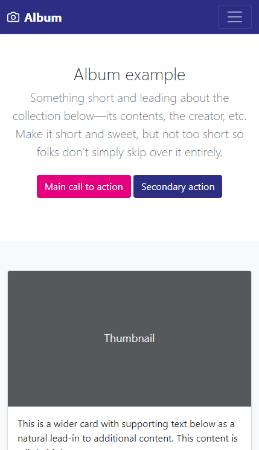

# Cvičení: SASS Bootstrap

Tvým úkolem bude donapojit do stránky Bootstrap a přizpůsobit jeho barvy. Výsledek by měl vypadat takto:



- Forkni tento repozitář a jeho kopii si naklonuj.

- Nainstaluj předpřipravené závislosti pomocí příkazu `npm install`.

- Vyzkoušej převést SASS styly na CSS přes `npm run build`.

- Zkontroluj výsledek.

  - Otevři `index.html` v prohlížeči. Text by měl být bezpatkovým fontem.

- Doninstaluj balíček s [Bootstrapem](https://www.npmjs.com/package/bootstrap).

- Spusť vývojový režim `npm run dev`. S každou změnou v SASSu by se mělo přegenerovat výsledné CSS.

- Přidej Bootstrap do stylů.

  - Na konec souboru `styly/hlavni.scss` přidej `@import '../node_modules/bootstrap/scss/bootstrap';`

  - Ulož a koukni do prohlížeče. Stránka by měla být téměř celá nastaylovaná.

  - Oprav doprava posunuté popisky `Thumbnail` v dlaždicích. Naimportuj ještě soubor `bd-placeholder-img.scss`.

- Současný stav můžeš porovnat s ukázkou [zde](https://getbootstrap.com/docs/5.1/examples/album/).

- Odliš tvou verzi od ukázkového příkladu.

  - Před importy přidej nastavení hlavní, vedlejší a tmavé barvy. Můžeš použít Czechitas barvy nebo tvé vlastní.

    ```scss
    $primary: #e6007e;
    $secondary: #2d2e83;
    $dark: $secondary;
    ```

    Styly výše by měly přebarvit tlačítka a horní lištu.

## Bonus

Oživ hamburger menu v pravém horním rohu obrazovky zapojením JavaScriptu, aby na tlačítko šlo klikat a rozbalovat tím skrytý obsah. Vlož před zavírací tag `</body>` skript `<script src="node_modules/bootstrap/dist/js/bootstrap.bundle.min.js"></script>`.

Zajímáš se o Bootstrapu víc? Prozkoumej [dokumentaci](https://getbootstrap.com/docs/5.1/components/buttons/). Můžeš například kouknout, jaké komponenty má Bootstrap předchystané.
